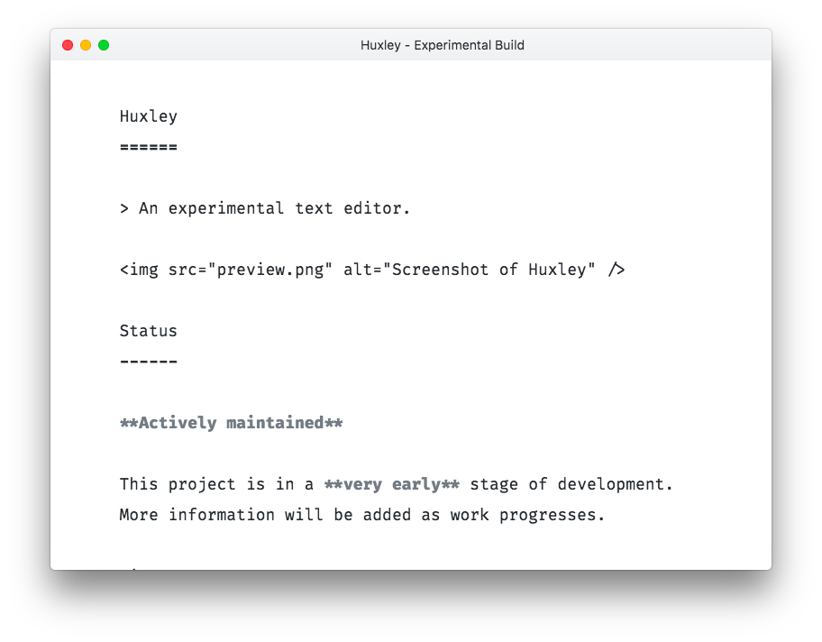

Huxley
======

> An experimental text editor.

Status
------

**Actively maintained**

This project is in a **very early** stage of development.
More information will be added as work progresses.

License
-------

Huxley and its source code are freely distributed under the [MIT license](LICENSE).
